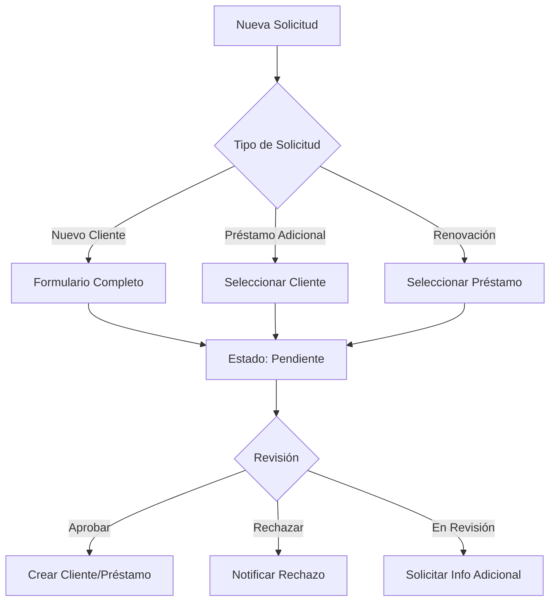

# FINAMA - Sistema de Control Financiero Avanzado

Sistema integral de control financiero para préstamos con **Business Intelligence**, **solicitudes avanzadas** y **renovaciones automáticas**.

## 🚀 Características Principales

### ✨ Funcionalidades Actuales
- **Gestión de Clientes**: CRUD completo con perfiles detallados
- **Préstamos Inteligentes**: Cálculos automáticos con múltiples frecuencias
- **Pagos y Seguimiento**: Control de pagos con alertas automáticas
- **Dashboard BI**: Métricas en tiempo real y visualizaciones avanzadas

### 🆕 Nuevas Funcionalidades
- **Sistema de Solicitudes**: 
  - Nuevos clientes pueden solicitar préstamos
  - Clientes existentes pueden solicitar préstamos adicionales
  - **Renovación de préstamos** con nuevas condiciones
- **Flujo de Aprobación**: Estados de solicitud (Pendiente → En Revisión → Aprobada/Rechazada)
- **Interfaz Ultra Moderna**: Diseño glassmorphism con animaciones fluidas
- **Dashboard Avanzado**: Métricas visuales con progreso y tendencias

## 🏗️ Arquitectura Técnica

### Backend (Node.js + Express + Supabase)
```
/backend/
├── src/
│   ├── index.js              # Servidor principal con todas las rutas
│   ├── services/
│   │   └── calculo.js        # Cálculos financieros avanzados
│   └── calculos.js           # Análisis y métricas
└── package.json
```

### Frontend (React + Chakra UI + Framer Motion)
```
/frontend/
├── src/
│   ├── App.jsx               # Aplicación principal
│   ├── theme.js              # Tema ultra moderno
│   ├── components/
│   │   ├── Dashboard.jsx     # Dashboard con métricas BI
│   │   ├── SolicitudesManager.jsx  # Gestión de solicitudes
│   │   ├── SolicitudForm.jsx      # Formulario de solicitudes
│   │   ├── PrestamoList.jsx       # Lista con renovaciones
│   │   └── ...componentes existentes
│   └── pages/
│       └── Home.jsx          # Página principal con tabs
└── package.json
```

## 🎯 Tipos de Solicitudes

### 1. **Nuevo Cliente**
- Formulario completo para registro
- Información financiera opcional
- Aprobación manual

### 2. **Préstamo Adicional**
- Para clientes existentes
- Basado en historial crediticio
- Proceso simplificado

### 3. **Renovación**
- Actualizar condiciones existentes
- Cambiar monto, tasa o cuotas
- Mantener historial del préstamo original

## 🔧 Configuración y Despliegue

### Requisitos Previos
- Node.js 18+
- Cuenta en Supabase
- Supervisor (para producción)

### Variables de Entorno
```bash
# Backend (.env)
SUPABASE_URL=tu_url_de_supabase
SUPABASE_KEY=tu_clave_de_supabase
PORT=3001
CORS_ORIGIN=http://localhost:3000
```

### Base de Datos
Ejecutar en Supabase SQL Editor:
```sql
-- Tablas básicas (ya existentes)
CREATE TABLE clientes (
    id SERIAL PRIMARY KEY,
    nombre VARCHAR(100) NOT NULL,
    email VARCHAR(100),
    telefono VARCHAR(15)
);

CREATE TABLE prestamos (
    id SERIAL PRIMARY KEY,
    cliente_id INT REFERENCES clientes(id),
    monto NUMERIC(12,2),
    tasa NUMERIC(5,2),
    cuotas INT,
    frecuencia VARCHAR(20),
    saldo NUMERIC(12,2),
    fecha_inicio DATE,
    solicitud_origen_id INT -- NUEVA COLUMNA
);

CREATE TABLE pagos (
    id SERIAL PRIMARY KEY,
    prestamo_id INT REFERENCES prestamos(id),
    fecha_pago DATE,
    monto NUMERIC(12,2)
);

-- Nueva tabla para solicitudes
-- Ver: /database/solicitudes_schema.sql
```

### Instalación y Ejecución

#### Desarrollo
```bash
# Backend
cd backend && npm install
npx nodemon src/index.js

# Frontend  
cd frontend && yarn install
npm start
```

#### Producción con Supervisor
```bash
# Configurar supervisor
sudo /app/scripts/setup_supervisor.sh

# Controlar servicios
sudo supervisorctl status
sudo supervisorctl restart finama-backend
sudo supervisorctl restart finama-frontend
```

## 🎨 Diseño Ultra Moderno

### Características Visuales
- **Glassmorphism**: Efectos de vidrio con blur
- **Gradientes Dinámicos**: Colores brand y accent
- **Micro-animaciones**: Hover effects Y transitions suaves
- **Dark/Light Mode**: Tema automático del sistema
- **Cards Flotantes**: Shadow effects con hover
- **Typography Moderna**: Font family Inter

### Paleta de Colores
```javascript
brand: {
  500: "#1890FF", // Azul principal
  600: "#096DD9"
}
accent: {
  500: "#EB2F96", // Rosa accent
  600: "#C41D7F"
}
```

## 📊 Dashboard y Métricas

### Métricas Principales
- **Total Clientes**: Con tendencia de crecimiento
- **Préstamos Activos**: Promedio por cliente
- **Saldo Total**: Porcentaje recuperado
- **Solicitudes**: Pendientes vs procesadas

### Visualizaciones
- Progress bars animadas
- Cards con gradientes
- Badges de estado
- Iconos personalizados

## 🔄 Flujo de Solicitudes



## 🚀 Próximas Mejoras

### Funcionalidades Planificadas
- [ ] Notificaciones push/SMS
- [ ] Reportes PDF automáticos
- [ ] Machine Learning para scoring
- [ ] App móvil (React Native)
- [ ] Integración con pagos online
- [ ] Sistema de referidos
- [ ] Análisis predictivo de mora

### Integraciones Futuras
- WhatsApp Business API
- Twilio SMS
- Stripe/PayPal
- Power BI / Tableau
- AWS S3 para documentos

## 🛠️ API Endpoints

### Solicitudes
```
GET    /solicitudes              # Listar solicitudes
POST   /solicitudes              # Crear solicitud
PATCH  /solicitudes/:id          # Aprobar/Rechazar
```

### Renovaciones
```
POST   /prestamos/:id/renovar    # Solicitar renovación
```

### Dashboard
```
GET    /dashboard                # Métricas generales
GET    /analisis/:clienteId      # Análisis por cliente
```

## 📞 Soporte

Para soporte técnico o consultas:
- **Sistema**: FinaMa v2.0
- **Stack**: React + Node.js + Supabase
- **Última actualización**: Enero 2025

---

**FinaMa** - *Transformando la gestión financiera con tecnología de vanguardia* 🚀
